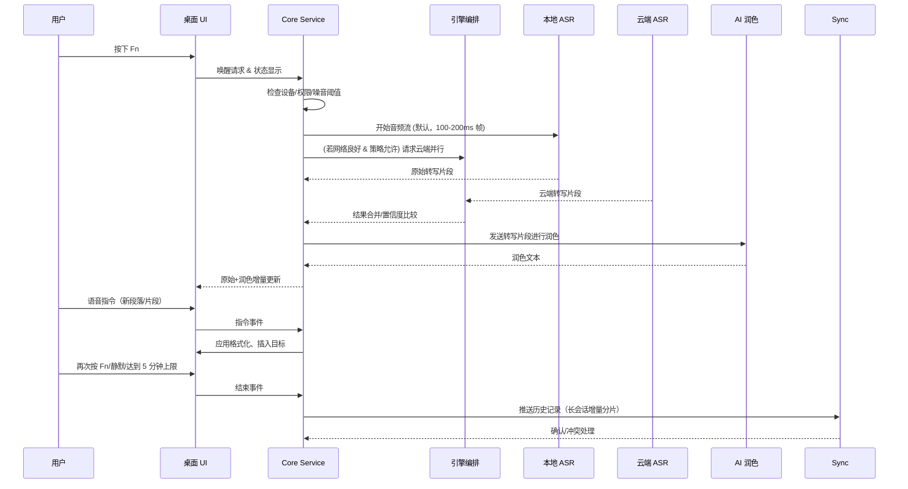

# Flowwisper Fn 语音输入助手技术架构设计

## 1. 文档目的与范围
本架构文档旨在将《Flowwisper Fn 语音输入助手 PRD》中提出的产品目标落实为可执行的技术方案，为研发、测试、运维与安全团队提供统一的系统视图与实施依据。文档覆盖桌面端应用、语音 AI 管道、同步与管理后台、数据安全与合规等核心域，不包含未来移动端与开放 API 的详细设计。后续版本在产品迭代时将补充增量内容。

## 2. 目标回顾与约束
### 2.1 核心业务目标
- 提供跨平台、低延迟的语音转文字能力，达到“按 Fn 键随处可用”。
- 输出“原始转写 + AI 润色稿”双轨文本，支持格式指令、片段库与多语言识别。
- 兼顾本地隐私与云端准确率，为合规敏感行业提供企业级安全能力。

### 2.2 关键非功能指标
- 端到端延迟 < 1.5s（原始稿），AI 润色延迟 < 2s；实时首字反馈目标 < 400ms。
- 单次会话需支持最长 5 分钟连续录音，并在此期间维持流式转写稳定性。
- 转写准确率（中/英文）≥ 92%，且具备多引擎扩展能力。
- 支持 macOS 12+ 与 Windows 10+，容忍不同键盘热键能力。
- 具备 SOC2/HIPAA 对标的安全、审计、数据治理能力。

### 2.3 需求对齐说明
- PRD 对端到端延迟提出了 <1.5s 目标，但未显式提出“首字 <400ms”与“单次会话最长 5 分钟”的增强体验指标。本架构将其纳入关键非功能指标，需在 PRD 或需求待办中补充对应条目。
- 若产品后续确认取消 5 分钟长时会话需求，可回退相关缓冲与持久化设计以降低客户端资源占用。

### 2.4 约束条件
- 桌面端需采用单一代码库实现双平台交付，减少维护成本。
- 本地识别需可离线运行并支持量化，以适配低功耗设备。
- 云端能力需部署在合规的公有云区域，支持企业专属租户。

## 3. 架构原则
1. **体验优先**：将热键响应、低延迟音频处理放在首位，后台同步与大模型调用采用异步解耦。
2. **隐私保护默认开启**：本地优先处理语音，云端上传采用显式授权并透明展示。
3. **模块化引擎抽象**：语音识别、润色、摘要等能力以插件化接口接入，便于更换或扩展供应商。
4. **可观测与可运营**：所有本地与云端关键路径提供日志、指标与诊断能力，支持快速排障。

## 4. 总体架构概览
系统采用“桌面端前台 UI + 本地核心服务 + 可选云端 AI 服务 + 协作与管理后台”的分层架构：

```mermaid
graph TD
    subgraph Client[桌面端]
        UI[Tauri 前端壳层]
        Core[Flowwisper Core Service (Rust)]
        LocalASR[本地语音识别引擎]
        LocalNLP[本地润色/指令解析模块]
    end

    subgraph Cloud[云端]
        API[边缘网关/API 层]
        HybridRouter[引擎编排服务]
        CloudASR[云端语音识别集群]
        LLM[AI 润色与摘要服务]
        Sync[同步与存储服务]
        Admin[企业管理与审计]
    end

    subgraph Data[存储]
        LocalDB[(SQLite + SQLCipher)]
        ObjectStore[(对象存储/语音缓存)]
        MetaDB[(PostgreSQL 多租户)]
        Logs[(OpenSearch/Blob 日志)]
    end

    UI --> Core
    Core --> LocalASR
    Core --> LocalNLP
    Core <--> API
    API --> HybridRouter
    HybridRouter --> CloudASR
    HybridRouter --> LLM
    Core <--> LocalDB
    Core <--> ObjectStore
    Sync <--> MetaDB
    Admin <--> MetaDB
    API --> Sync
    Core --> Sync
    Logs --> Admin
```

## 5. 关键组件设计
### 5.1 桌面端 Tauri 壳层
- **职责**：提供跨平台 UI、系统托盘、快捷键配置界面、设置与历史浏览页面；承载 Web 前端资源。
- **技术选型**：Tauri + React/TypeScript。
  - 选择理由：Tauri 以 Rust 作为后端绑定，内存占用与安全性优于 Electron；支持 macOS/Windows 原生打包；方便与 Rust 音频核心共享内存。
- **主要模块**：
  - 热键监听与状态同步（通过 Rust 插件暴露）。
  - 语音浮层 UI、实时文本展示、格式化指令输入。
  - 声波状态条：在 `PreRoll` 阶段以低透明度“预热”动画提示麦克风即将启用，在 `Recording` 阶段以 60fps 的等效采样刷新实时声波与噪声阈值，让用户直观看到系统正在拾音。
  - 会话状态 HUD：根据 Core Service 推送的会话状态机（准备中/录音中/处理中/完成/异常）动态渲染颜色、文案、动画，并显示 5 分钟长会话进度、网络/同步状态与云端回退提示。
  - 设置面板（设备、识别引擎、隐私策略、词典管理、辅助功能）。
  - 历史记录与片段库管理，调用 Core Service API。
  - 首次启动向导：覆盖权限引导、设备测试、降噪校准回放、Fn 键兼容性检测结果展示。

### 5.2 Flowwisper Core Service（Rust）
- **职责**：常驻后台守护进程，负责热键捕获、音频采集与预处理、引擎编排、结果回传与本地存储。
- **关键子模块**：
  1. **Hotkey Compatibility Layer**：基于 macOS `IOHIDManager` / Windows `SetWindowsHookEx` 捕获 Fn 或自定义组合；维护设备适配矩阵（内置、外接 USB/蓝牙、BootCamp），支持驱动级退化路径（如 Windows Raw Input、macOS Karabiner 虚拟设备）；检测冲突时在 UI 触发回退组合并记录原因。
  2. **Audio Pipeline**：调用 `CoreAudio`/`WASAPI` 以 16kHz PCM 流捕获，内置 VAD、降噪（RNNoise）、自动增益控制；暴露实时波形与信噪比给 UI。
     - 新增 `Waveform Telemetry Bridge`：将音频帧的包络线与 VAD 状态归一化后以 30-60fps 传输给前端，提供“正在拾音”“静音”视觉差异；在 `PreRoll` 阶段输出平滑缓入动画，确保用户长按后立即看到波形反馈。
     - 为满足 5 分钟长会话需求，音频管线采用循环缓冲（默认 8MB）+ 分段落盘（30 秒分片，AES 加密），确保长时录音不会阻塞内存；同时支持断网缓存并在会话结束后清理。
     - 通过可调节帧长度（默认 200ms，退化到 100ms）缩短首字延迟，首帧直接进入增量解码队列。
  3. **Device Calibration Manager**：首次启动时收集 5 秒环境噪声，使用短时能量 + 频谱平滑估算阈值，输出推荐灵敏度；支持用户回放测试片段、存储多设备配置并持续自适应调整。
  4. **Engine Orchestrator**：根据用户策略与网络状态在本地、云端引擎之间动态切换；使用 gRPC/WebSocket 与云端保持低延迟连接，并同步性能探针结果给监控。
  5. **Formatting & Command Parser**：将语音指令解析为格式化操作（段落、项目符号、片段触发）；结合前景应用信息（Accessibility API / Windows UI Automation）进行语境调整。
  6. **Context Collector**：聚合当前前景应用、语言设置、剪贴板摘要、用户偏好，向片段引擎与 LLM 提供安全过滤后的上下文；对敏感应用（银行、密码管理器）启用黑名单保护。
  7. **Persistence Layer**：通过 `SQLCipher` 加密 SQLite 存储历史、词典、片段库；启用 FTS5 全文索引与分区表满足 500+ 条记录搜索；本地语音缓存采用加密文件夹并定期清理。
  8. **Sync Agent**：与云端同步服务进行差量同步，支持离线队列、冲突解决与租户策略下载。
  9. **Session State Manager**：维护录音状态机（Idle → PreRoll → Recording → Processing → Publishing → Completed/Failed），监听音频管线、引擎编排与同步事件，通过内存消息总线（Tokio broadcast channel）向 Tauri 前端推送状态；触发提示音、托盘动画与无障碍文本播报，确保长按 Fn 后 400ms 内给出“准备中”反馈，并在处理/重试阶段持续提示用户工具正在工作。

### 5.3 语音与 AI 引擎
- **本地识别**：`whisper.cpp`（ggml/GGUF 模型，支持多语言），集成 GPU 加速（Metal / DirectML）。提供量化模型（int4/int8）以减小内存。
- **本地润色**：轻量规则引擎 + 可选 LoRA 精调的小型语言模型（如 `Llama 3.1 8B` 量化版）实现语气词过滤、标点补齐。
- **云端识别**：优先采用 Azure Speech（实时流式 API），备用 Google Speech-to-Text；通过统一接口抽象支持扩展。
- **云端润色与摘要**：调用 OpenAI Realtime / Azure OpenAI GPT-4o mini 进行润色、摘要生成；可按租户配置模型与数据驻留区域。
- **长会话稳态策略**：云端与本地引擎均开启增量检查点（每 30 秒生成语义稳定片段）；当会话超过 2 分钟时，启用片段压缩与节奏检测，避免缓冲漂移。若云端返回延迟超过 1s，立即回退至本地模型并在会话结束后进行云端再处理。
- **片段库与语境化模板**：基于模板 DSL（变量校验、权限标签）+ LLM Function Calling，根据 Context Collector 提供的前景应用/语言/用户角色自动选择模板；支持策略引擎限制敏感片段在特定应用中启用。

### 5.4 云端服务层
1. **API 网关**：使用 `FastAPI` + `uvicorn` 或 `Node.js (NestJS)` 提供 HTTPS 入口、OAuth2/JWT 认证、多租户路由、速率限制。
2. **Hybrid Engine Router**：Go/Rust 编写的编排服务，负责会话级别的引擎选择、负载均衡、熔断与回退。
3. **Sync Service**：基于 `Hasura + PostgreSQL` 或 `Supabase` 实现实时同步、冲突解决、历史版本；使用 `Row Level Security` 实现租户隔离。为满足私有部署与数据驻留要求，提供“一键迁移”脚本将 Supabase 托管实例迁移至自管 Postgres/Hasura（导出 schema、差量数据、重新配置 JWT 秘钥），并支持企业租户选择自定义对象存储/KMS。
4. **Admin Console & Policy Service**：React + Next.js 管理后台，支持企业策略配置、审计日志查询、租户密钥管理。
5. **Notification & Update Service**：`AWS SNS`/`Azure Event Grid` 发送版本更新、异常告警；桌面端通过 WebSocket 订阅。
6. **Logging & Observability**：`OpenTelemetry` + `Tempo`/`Jaeger` 采集链路，`Prometheus` 监控延迟、准确率；`OpenSearch` 存储审计与应用日志。

### 5.5 数据存储
- **本地**：SQLCipher 加密 SQLite（历史、词典、片段库）；启用 `FTS5` + `bm25` 索引实现 500 条历史记录内毫秒级全文搜索；加密语音缓存目录（AES-256），定期清理；配置文件采用 TOML/JSON + HMAC 校验，并在 Secure Enclave/TPM 缓存密钥分片。
- **云端元数据**：PostgreSQL 多租户架构，采用 `tenant_id` 分区；敏感字段使用 `pgcrypto` 或应用层加密。
- **对象存储**：加密的临时语音片段、日志附件存储于 S3 兼容存储，生命周期策略 7 天自动清除。
- **密钥管理**：利用云 KMS（Azure Key Vault/AWS KMS）管理租户主密钥，本地通过 Secure Enclave/DPAPI 加密密钥缓存；企业模式提供密钥轮换 API、自动化审计记录与租户自带密钥（BYOK）接入流程。

## 6. 主要流程设计
### 6.1 Fn 快捷语音输入流程


#### 6.1.1 会话状态机与状态反馈
- **状态划分**：`Idle`（等待热键）→ `PreRoll`（Fn 长按 400ms 内展示“准备中”动画、播放提示音）→ `Recording`（实时波形、剩余时长倒计时、云端/本地引擎指示）→ `Processing`（停止采集后展示转写/润色进度、云端同步百分比）→ `Publishing`（插入/复制/同步动作进行中）→ `Completed`/`Failed`（成功提示或可操作错误信息）。
- **声波可视化反馈**：在 `Idle` → `PreRoll` 过渡时加载淡入的“预热”波形，`Recording` 阶段根据包络线强度调整振幅与颜色（例如绿色=拾音良好、黄色=音量偏低、红色=噪音/爆音），`Processing` 阶段转为轻微呼吸灯，提示仍在处理。
- **事件触发**：Session State Manager 监听热键、音频帧、ASR/LLM 回调、同步结果，并在状态切换时推送到 UI；若 300ms 内未收到 ASR 反馈则保持“处理中”并展示旋转进度。
- **用户反馈通道**：UI 浮层动画 + 托盘图标点亮/闪烁 + 可选语音播报；辅助功能模式下提供字幕条与高对比度颜色。长会话超过 4 分钟或接近 5 分钟上限时，HUD 弹出提醒并允许用户延长或分段保存。
- **异常处理**：Processing 超过 3 秒无结果时提示“仍在处理，可继续说话或稍候”；失败状态展示“重试/保存至草稿/提交诊断”选项，并在通知中心记录。

### 6.2 历史记录同步流程
1. Core Service 将本地变更写入 `change_log` 表并加密。
2. Sync Agent 检测到网络可用后，通过双向 WebSocket/gRPC 与云端 Sync Service 建立会话。
3. 双方交换 last_sync_token，进行增量 diff。
4. 冲突记录使用基于时间戳 + 用户优先级的策略解决，保留双方版本并提示用户。
5. 同步成功后更新本地 token，并触发 UI 刷新。

### 6.3 片段库触发流程
- Core 监听语音识别结果，当检测到 `trigger phrase` 时调用模板引擎生成文本。
- 若模板包含变量占位符，UI 弹出表单收集值；支持调用 LLM 生成初稿。
- 结果插入光标位置或发送至指定应用。

### 6.4 首次启动校准流程
1. UI 引导用户授权麦克风、辅助功能/可访问性权限，并与 Hotkey Compatibility Layer 协同验证 Fn 键可捕获。
2. Device Calibration Manager 录制 5 秒环境噪音，计算推荐阈值并回放样例，让用户确认效果。
3. 若检测到 Fn 键不可捕获或噪音阈值过高，UI 提供备选热键、强降噪模式与问题上报通道。
4. 完成设置后同步设备配置至加密存储，并在 Sync Agent 中注册校准结果，供多设备复用。

## 7. 性能预算与容量规划
- **端到端延迟拆解（目标设备：MacBook Air M2 / Surface Laptop 5）**：
  - 热键捕获 + UI 唤起：< 40ms。
  - 音频缓冲帧：默认 200ms 推送一次 3200 帧样本；追求更快首字时缩短为 100ms 并启用首帧直通。
  - Whisper Tiny-int8 流式解码：35-45ms/帧（CPU），支持 Metal/DirectML GPU 加速降至 20ms；首帧提前触发局部解码以实现 <400ms 首字反馈。
  - LLM 润色（GPT-4o mini streaming）：首 token 300-400ms，后续 50ms/token，采用增量句子合并，保证 0.5s 内输出润色版本。
  - 总体首帧延迟预计 1.1-1.3s，满足 PRD 目标，低算力设备触发自动降级策略（改用 Whisper base-int8 + 本地润色 0.7s 延迟）。
- **长会话资源规划**：
  - 本地缓存限制：默认仅保留最近 3 分钟音频在内存，其余滚动落盘；总占用 < 80MB，超限触发提示或暂停。
  - 云端并发：5 分钟会话按 20% 用户占比估算，需保证编排服务支持会话粘性与断点续传，Prometheus 监控 `session_duration` P95。
  - UI 提示：浮层显示剩余时间倒计时，接近 5 分钟时提前 15 秒提示用户延长或结束。
- **资源占用**：Core Service 常驻内存 < 250MB；Whisper 模型按 tiny/base/small 选择，下载策略基于设备硬件评分；GPU/NNAPI 探测决定是否启用本地 LLM。
- **云端容量**：每 1000 并发会话需要 8 台 GPU 节点（A10G 24GB）运行润色模型，熔断策略优先回退至本地规则润色。
- **网络退化策略**：RTT > 200ms 或丢包率 > 5% 时自动切换为本地-only 模式，并在 UI 显示“网络不佳，已切本地”。
- **长会话故障处理**：监控连续 30 秒无识别输出或云端超时，触发本地回放提示；会话异常终止时保留已完成片段，并提示用户重新继续录制剩余部分。

## 8. 技术选型分析
### 8.1 桌面框架
| 候选 | 优点 | 缺点 | 结论 |
| --- | --- | --- | --- |
| Electron | 成熟生态、组件丰富 | 内存占用高、打包体积大、安全面更广 | 备选，若未来需兼容复杂网页组件 |
| Flutter | UI 表现出色、跨端统一 | 系统 API 接入需编写大量平台插件，语音底层对接复杂 | 不选 |
| **Tauri + Rust** | 体积小、安全模型清晰、Rust 与音频处理协同好 | WebView 生态较新，需要自研部分组件 | **首选** |

### 8.2 本地语音引擎
| 候选 | 优点 | 缺点 | 结论 |
| --- | --- | --- | --- |
| Vosk | 轻量、嵌入式部署 | 对中文/多语种支持有限，模型更新慢 | 备选 |
| **whisper.cpp** | 多语言支持广泛、社区活跃、可 GPU 加速 | 设备算力要求较高，需优化量化模型 | **首选** |
| Kaldi 定制 | 可高度定制 | 实施成本高、维护成本大 | 不选 |

### 8.3 云端语音与 AI
| 能力 | 选型 | 依据 |
| --- | --- | --- |
| 流式语音识别 | Azure Speech（主）/Google Speech（备） | 提供企业合规认证、实时低延迟、SDK 成熟 |
| AI 润色/摘要 | Azure OpenAI GPT-4o mini，OpenAI Realtime API | 支持 Function Calling、低延迟会话、可配置区域，满足高准确率需求 |
| 模型管理 | BentoML + Kubernetes GPU 节点 | 支持后续自研模型上线、灰度发布、扩缩容 |

### 8.4 同步与后端
- `Supabase`（PostgreSQL + Realtime）作为快速交付方案；如需自管可迁移到自建 `Hasura + Postgres`，迁移脚本纳入发布流水线并支持回滚。
- 使用 `Rust`/`Go` 编写同步 Agent 与路由服务，确保性能与内存安全。
- 身份认证采用 `OAuth2.1` + `PKCE`，桌面端使用嵌入式浏览器完成登录。

### 8.5 DevOps 与部署
- 云端服务部署在 Kubernetes（AKS/EKS），使用 `Helm` 管理，`Argo CD` 实现 GitOps；定义金丝雀发布策略（1% → 10% → 100%），并使用 KEDA 根据音频流并发自动扩缩。
- CI/CD：GitHub Actions 负责构建 Tauri 包、运行 Rust/TypeScript 测试、构建容器镜像；集成性能基准（whisper.cpp 推理耗时、Fn 键响应）与 SAST/DAST 扫描。
- 桌面端发布：macOS 使用 `notarization`，Windows 使用 `MSIX`/`Code Signing`；提供离线安装包与哈希校验，企业模式支持 MDM 分发。

## 9. 安全与合规设计
1. **身份与访问控制**：多租户 RBAC，企业可配置 SSO/SAML；本地核心服务仅暴露回环端口，需 token 验证。
2. **数据加密**：静态数据使用 AES-256，传输使用 TLS1.3；语音上传支持端到端加密通道并自动销毁。
3. **审计与合规运营**：云端记录所有敏感操作（词典管理、策略变更）；配置日志保留周期（默认 365 天，可按租户策略调整），支持导出 SOC2/HIPAA 报告；企业模式默认启用强制 MFA、租户密钥轮换计划（30/90 天），并对 BYOK 进行年审。
4. **隐私控制面板**：提供数据可视化与一键清除；默认禁用云端上传，用户显式开启后触发告知，并提示数据驻留区域；支持导出合规证明与事件追踪报告。
5. **安全运维**：集成漏洞扫描（Dependabot、Trivy）、运行时防护（Falco），对桌面端签名校验；引入 Drata/Laika API 自动同步合规状态与证据。
6. **离线审计补采**：桌面端在离线模式缓存关键操作摘要（加密封装），恢复联网后自动上传并标记时间差，满足企业审计要求。

## 10. 可观测性与故障恢复
- **指标**：热键响应时间（P95 < 80ms）、音频管线延迟（P95 < 400ms）、本地/云端 ASR 准确率、润色延迟、同步成功率、崩溃次数、网络 RTT/丢包率、噪声阈值变化趋势。
- **日志**：分级采集（调试、本地诊断、云端审计），用户可一键导出并匿名化处理；日志上传前进行脱敏（正则/ML 匹配个人数据）。
- **追踪**：ASR/LLM 请求链路通过 OpenTelemetry Trace 关联，支持跨组件排查；桌面端通过批量上传 span，保障隐私。
- **异常自动处理**：网络中断自动回退至本地模式；引擎失败触发熔断并通知用户；Fn 键捕获失败触发重新绑定流程；噪声突增触发强降噪建议；崩溃后通过守护进程重启服务并恢复热键绑定。
- **告警策略**：Prometheus + Alertmanager 设置阈值（例如云端 RTT > 200ms、LLM 首 token > 600ms、同步失败率 > 5%），通过 PagerDuty/企业微信通知值守；桌面端向用户展示可操作提示与复原路径。

## 11. 可访问性与易用性设计
- UI 组件遵循 WCAG 2.1 AA：支持键盘导航、屏幕阅读标签（ARIA）、高对比度主题、字体放大/语音提示切换。
- 提供“听障模式”：实时字幕在浮层底部展示，同时将系统提示转写为文本通知；可输出可视化噪音电平帮助判断输入质量。
- 语音提示支持多语言 TTS，且可在设置中启用/关闭；辅助功能状态同步至企业策略，确保合规记录。

## 12. 扩展性与演进
- **功能扩展**：插件化指令体系，未来可增加“任务执行”“代码补全”等语音技能；提供 API Hook 支持第三方集成。
- **移动端规划**：沿用 Core Service API，替换音频采集与热键层；同步层与云端保持一致。
- **团队协作**：引入共享片段库、团队词典；借助 Sync Service 提供多端冲突解决与审批流程。

## 13. 开发里程碑与交付
| 阶段 | 时间 | 范围 | 技术重点 |
| --- | --- | --- | --- |
| MVP | 0-4 周 | 热键捕获、实时转写、粘贴/复制、历史记录、基础设置、首启校准 | 完成 Core Service、Tauri UI、whisper.cpp 集成、SQLCipher+FTS5、Fn 键兼容性基线 |
| Beta | 5-8 周 | AI 润色、片段库、个人词典、云端识别、隐私控制、日志、辅助功能 | 引擎编排、LLM streaming、Sync Service 雏形、合规运营流程、可观测性指标体系 |
| GA | 9-12 周 | 多语言检测、语气自适应、团队策略、性能与合规完善、企业私有部署 | GPU 优化、租户策略、Supabase→自建迁移、审计报告自动化、CI/CD 与自动更新 |

## 14. 风险与缓解
| 风险 | 描述 | 缓解措施 |
| --- | --- | --- |
| Fn 键不可用 | 外接键盘或操作系统限制 | 提供自定义热键、驱动层适配列表、UI 引导、自动上报兼容性；规划与主流键盘厂商联合测试 |
| 本地算力不足 | Whisper 模型运行缓慢 | 提供量化模型、自动切云端、提示硬件建议、预下载模型梯度并允许租户锁定策略 |
| 云端依赖故障 | 外部 ASR/LLM 服务异常 | 引入多供应商、熔断重试、降级到本地模式、开放故障状态面板 |
| 合规审查复杂 | 不同行业法规差异大 | 企业模式预设模板、与第三方审计合作、提供可配置的日志保留/密钥轮换策略 |
| 数据同步冲突 | 离线编辑导致覆盖 | 基于版本向量的冲突解决、用户可视化选择、提供导出/恢复机制 |
| 延迟目标未达成 | 设备性能、网络不稳定 | 性能预算监控、自动降级、预警阈值与 A/B 验证 |
| 模板滥用风险 | 片段包含敏感信息 | 模板安全标签、审批流、上下文黑名单 |

## 15. 结论
通过 Tauri + Rust 的本地核心、whisper.cpp 本地引擎与云端混合 AI 服务，Flowwisper Fn 能够在保证体验与隐私的前提下实现跨平台语音输入助手。模块化编排与多租户同步架构支持后续快速迭代 AI 能力与企业场景，符合 PRD 对“速度、质量、语境理解、合规信任”的目标定位。
