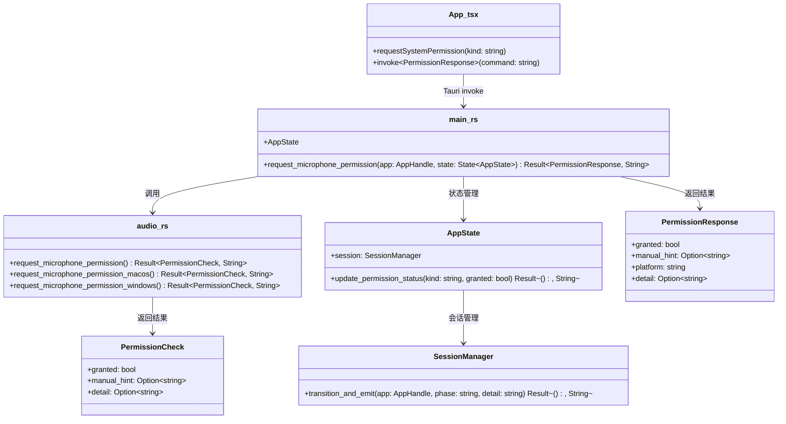
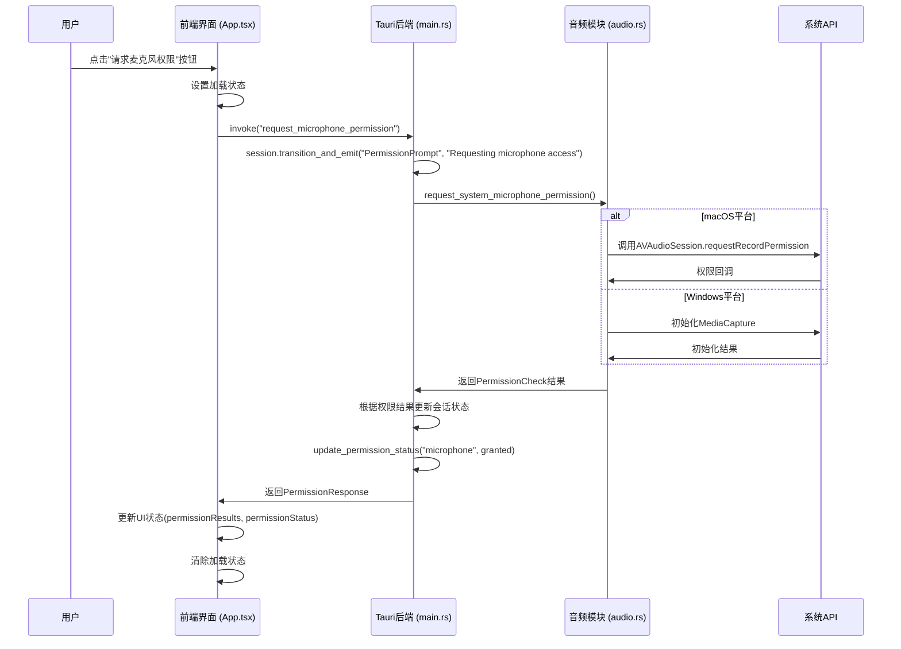

# "请求麦克风权限"功能详细技术文档

## 1. 概述

本文档详细描述了Flowwisper桌面应用中"请求麦克风权限"功能的完整实现逻辑，包括前端界面交互、Tauri后端处理以及系统级权限请求的全过程。

## 2. 功能触发流程

### 2.1 前端触发点

在`apps/desktop/src/App.tsx`中，用户点击"请求麦克风权限"按钮时会调用`requestSystemPermission`函数：

```typescript
const requestSystemPermission = (kind: "microphone" | "accessibility") => {
  setPermissionLoading((prev) => ({ ...prev, [kind]: true }));
  setGlobalError(null);
  const command =
    kind === "microphone"
      ? "request_microphone_permission"
      : "request_accessibility_permission";
  invoke<PermissionResponse>(command)
    .then((result) => {
      setPermissionResults((prev) => ({ ...prev, [kind]: result }));
      setPermissionStatus((prev) => ({ ...prev, [kind]: result.granted }));
    })
    .catch((err) =>
      setGlobalError(err instanceof Error ? err.message : String(err))
    )
    .finally(() =>
      setPermissionLoading((prev) => ({ ...prev, [kind]: false }))
    );
};
```

当`kind`为"microphone"时，会调用Tauri命令`request_microphone_permission`。

## 3. 调用链路和数据流

### 3.1 前端到Tauri后端 (apps/desktop/src-tauri/src/main.rs)

Tauri命令通过`tauri::generate_handler!`宏注册：

```rust
#[tauri::command]
fn request_microphone_permission(
    app: AppHandle,
    state: State<AppState>,
) -> Result<PermissionResponse, String> {
    state
        .session
        .transition_and_emit(&app, "PermissionPrompt", "Requesting microphone access")?;

    let platform = std::env::consts::OS.to_string();
    let permission = request_system_microphone_permission()?;

    if permission.granted {
        state.session.transition_and_emit(
            &app,
            "PermissionGranted",
            "Microphone permission granted",
        )?;
    } else {
        let detail = permission
            .manual_hint
            .clone()
            .unwrap_or_else(|| "需要用户手动授予麦克风权限".into());
        state
            .session
            .transition_and_emit(&app, "PermissionRequired", detail)?;
    }

    state
        .update_permission_status("microphone", permission.granted)
        .map_err(|err| format!("failed to persist microphone permission: {err}"))?;

    Ok(PermissionResponse {
        granted: permission.granted,
        manual_hint: permission.manual_hint,
        platform,
        detail: permission.detail,
    })
}
```

### 3.2 系统级权限请求 (apps/desktop/src-tauri/src/audio.rs)

根据操作系统平台调用不同的系统API：

```rust
pub fn request_microphone_permission() -> Result<PermissionCheck, String> {
    #[cfg(target_os = "macos")]
    {
        return request_microphone_permission_macos();
    }

    #[cfg(target_os = "windows")]
    {
        return request_microphone_permission_windows();
    }

    #[cfg(not(any(target_os = "macos", target_os = "windows")))]
    {
        Ok(PermissionCheck {
            granted: true,
            manual_hint: None,
            detail: Some("Linux 不需要额外的麦克风授权".into()),
        })
    }
}
```

### 3.3 macOS平台实现 (apps/desktop/src-tauri/src/audio.rs)

使用Objective-C桥接调用AVAudioSession API：

```rust
#[cfg(target_os = "macos")]
fn request_microphone_permission_macos() -> Result<PermissionCheck, String> {
    use block::ConcreteBlock;
    use objc::runtime::Object;
    use objc::{class, msg_send, sel, sel_impl};
    use std::sync::mpsc;
    use std::time::Duration as StdDuration;
    use tauri::async_runtime::block_on;

    block_on(async move {
        unsafe {
            // 获取 AVAudioSession 实例
            let session: *mut Object = msg_send![class!(AVAudioSession), sharedInstance];
            
            let (sender, receiver) = mpsc::channel();
            
            // 创建权限回调 block
            let block = ConcreteBlock::new(move |granted: bool| {
                let _ = sender.send(granted);
            });
            
            // 使用 autoreleasepool 确保 Objective-C 对象正确释放
            let pool: *mut Object = msg_send![class!(NSAutoreleasePool), new];
            
            // 复制 block 以确保其在整个调用期间保持有效
            let block_ptr = block.copy();
            
            // 调用系统权限API请求麦克风权限
            let _: () = msg_send![session, requestRecordPermission:&block_ptr];
            
            // 释放 autorelease pool
            let _: () = msg_send![pool, drain];
            
            // 等待权限请求结果
            match receiver.recv_timeout(StdDuration::from_secs(15)) {
                Ok(true) => {
                    Ok(PermissionCheck {
                        granted: true,
                        manual_hint: None,
                        detail: Some("已通过 AVAudioSession 请求麦克风权限".into()),
                    })
                },
                Ok(false) => {
                    Ok(PermissionCheck {
                        granted: false,
                        manual_hint: Some(
                            "请前往 系统设置 → 隐私与安全 → 麦克风，手动启用 Flowwisper。".into(),
                        ),
                        detail: Some("用户拒绝了麦克风权限".into()),
                    })
                },
                Err(_) => {
                    Err("未能在 15 秒内获取麦克风权限结果，请检查系统设置或稍后重试".into())
                },
            }
        }
    })
}
```

### 3.4 Windows平台实现 (apps/desktop/src-tauri/src/audio.rs)

使用Windows Runtime API：

```rust
#[cfg(target_os = "windows")]
fn request_microphone_permission_windows() -> Result<PermissionCheck, String> {
    use tauri::async_runtime::block_on;
    use windows::core::Error;
    use windows::Media::Capture::{
        MediaCapture, MediaCaptureInitializationSettings, StreamingCaptureMode,
    };

    block_on(async move {
        let capture = MediaCapture::new()?;
        let settings = MediaCaptureInitializationSettings::new()?;
        settings.SetStreamingCaptureMode(StreamingCaptureMode::Audio)?;
        match capture.InitializeWithSettingsAsync(&settings)?.await {
            Ok(_) => Ok(PermissionCheck {
                granted: true,
                manual_hint: None,
                detail: Some("成功初始化 MediaCapture 音频会话".into()),
            }),
            Err(err) => Err(err),
        }
    })
    .map_err(|err: Error| {
        format!(
            "请求麦克风权限失败: {:?}. 请在 设置 → 隐私与安全 → 麦克风 中开启 Flowwisper。",
            err
        )
    })
    .and_then(|result| {
        if result.granted {
            Ok(result)
        } else {
            Ok(PermissionCheck {
                granted: false,
                manual_hint: Some(
                    "请在 设置 → 隐私与安全 → 麦克风 中启用 Flowwisper，并允许应用访问麦克风。"
                        .into(),
                ),
                detail: result.detail,
            })
        }
    })
}
```

## 4. 类图



## 5. 时序图



## 6. 核心数据结构

### 6.1 PermissionResponse (前端)
```typescript
type PermissionResponse = {
  granted: boolean;
  manual_hint?: string | null;
  platform: string;
  detail?: string | null;
};
```

### 6.2 PermissionCheck (后端)
```rust
pub struct PermissionCheck {
    pub granted: bool,
    pub manual_hint: Option<String>,
    pub detail: Option<String>,
}
```

## 7. 错误处理

1. **超时处理**：在macOS平台，权限请求有15秒超时限制
2. **异常捕获**：使用`std::panic::catch_unwind`捕获系统调用可能的异常
3. **平台兼容性**：对不支持的平台返回默认成功状态
4. **用户提示**：根据不同平台提供具体的系统设置指引

## 8. 状态管理

权限状态通过AppState进行持久化管理：
1. 在Tauri后端更新内存状态
2. 通过`update_permission_status`方法持久化到配置文件
3. 前端通过`permission_status`命令获取当前权限状态