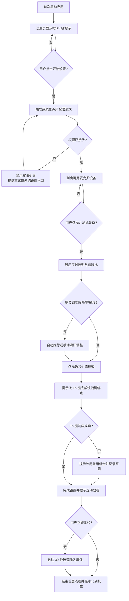
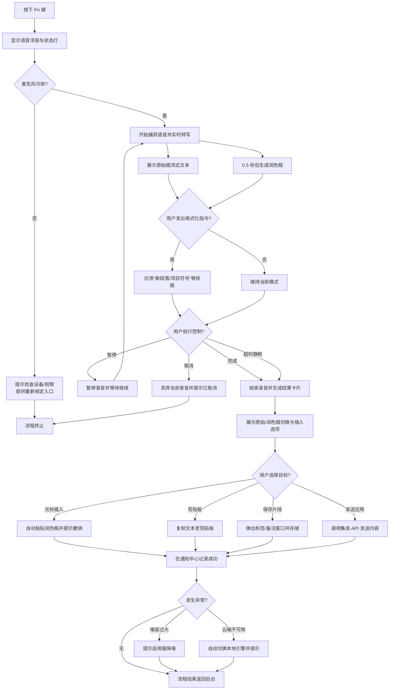
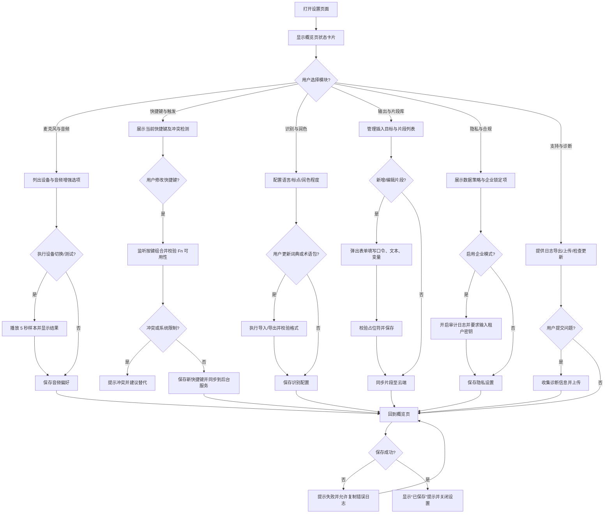

# Flowwisper Fn 语音输入助手 PRD

## 1. 产品概述
Flowwisper Fn 语音输入助手是一款在 macOS 与 Windows 平台均可使用的桌面应用。用户按下键盘上的 Fn（Function）键即可唤起麦克风，实时捕获语音并转换为文字，帮助用户在任意应用中实现快速语音输入，提高效率并减少键盘输入负担。产品定位为面向专业创作与知识工作者的“随处可用语音输入层”，与现有键盘输入并行存在，强调跨平台一致体验与低门槛。

### 1.1 Flow Wispr 产品调研洞察
对标产品 Flow（Wispr Flow）目前在 Mac、Windows、iOS 多端提供语音输入能力，主打“在任意应用中 4 倍于键盘速度的语音输入”，并结合 AI 自动润色实现“说话即成稿”。核心亮点包括：
- **跨应用覆盖**：无需嵌入插件，在 WhatsApp、VS Code、Teams、Notion 等桌面与移动应用中直接口述输入。
- **AI 自动润色**：实时去除语气词、填补标点，输出结构化、清晰的文本，被描述为“将 rambled thoughts 转化为 polished writing”。
- **个人词典与语境自适应**：自动学习用户专有名词，按应用调整语气语调，支持超过 100 种语言自动识别。
- **语音片段库**：可创建语音触发的文本片段，快速插入常用话术或模板。
- **多端同步**：桌面与移动端词典、历史记录同步，强调随时随地一致体验。
- **合规与行业覆盖**：公开强调 SOC2 Type II、HIPAA 准备度，面向医疗、政府、法律、教育等对安全合规要求高的行业场景。

上述能力展示了成熟竞品在“速度、质量、语境理解、合规信任”四个维度的综合发力，对 Flowwisper 的规划具有直接参考价值。

## 2. 产品目标
1. 提供跨平台、低延迟的语音转文字能力，目标达到“4 倍于键盘输入”的内容产出效率体验。
2. 支持按 Fn 键即用、随处可用的语音输入流程，并输出“清晰、结构化”的润色文本。
3. 通过本地与云端混合方案，兼顾隐私、准确率与资源消耗，满足安全敏感行业的部署要求。
4. 打造个人词典、语境自适应与语音片段等 AI 增强能力，建立差异化竞争力。

## 3. 目标用户
- 需要频繁输入文稿、邮件、代码或资料的专业人士（咨询、产品、工程、设计等）。
- 面向客户沟通的团队（销售、客服、客户成功），追求更快的反馈速度。
- 对语音输入有刚需的行业人群（医疗、政府、法律、教育等）与合规敏感用户。
- 需要减少键盘操作的行动不便用户或有 RSI 风险的长时间键入者。
- 需要快速记录灵感、跨语言协作的内容创作者与多语言工作者。

## 4. 使用场景
1. **工作写作**：用户在文档或邮件中按 Fn 键直接口述内容，系统实时输出文字。
2. **会议记录**：会议过程中按 Fn 键启动录音转写，结束后自动生成摘要。
3. **客服与销售**：使用语音片段库快速插入标准话术，自动调整语气适配 IM、邮件等不同渠道。
4. **跨语言协作**：在全球团队中自动识别并转写不同语言，保持上下文准确。
5. **灵感速记**：随时按 Fn 键记录灵感点子，AI 自动润色成结构化笔记或代办事项。

## 5. 用户旅程与典型 Use Case
1. 用户安装并首次启动应用，完成麦克风权限授权与语音引擎选择。
2. 应用在系统托盘常驻，提供状态指示与设置入口。
3. 用户在任意界面按 Fn 键触发语音输入：
   - 屏幕上出现浮动提示、噪音电平与剩余时长。
   - 应用捕获语音并进行实时转写与 AI 自动润色，展示增量结果与编辑建议。
   - 可按 Fn 键再次结束录音、语音命令“完成”或等待自动超时。
4. 转写文本根据设置自动粘贴到光标位置、复制到剪贴板、发送至指定应用或保存至历史记录。
5. 用户可在历史记录中搜索、编辑与导出转写文本，并跨设备同步个人词典与片段库。

### 5.1 Use Case：首次启动与麦克风设置
**触发条件**：用户首次安装并打开应用。

**关键步骤**：
1. **欢迎页与权限提示**：展示简短 onboarding，说明“按 Fn 键即可开始语音输入”，引导用户点击“开始设置”。
2. **系统权限请求**：
   - macOS：调用系统弹窗请求麦克风访问权限，并提供“若被拒绝，前往系统设置 > 安全性与隐私 > 麦克风启用 Flowwisper”的指引链接。
   - Windows：调用麦克风隐私权限提示，若检测到系统层面已禁用麦克风，给出“打开设置 > 隐私 > 麦克风”的跳转按钮。
3. **设备选择与测试**：列出可用麦克风设备（内置、外接 USB/蓝牙），支持播放提示音与实时音量条反馈；用户可点击“开始测试”对着麦克风说话，系统显示实时波形与信噪比。
4. **降噪与灵敏度校准**：提供“自动推荐”“自定义”两种模式，自动读取环境噪音计算推荐阈值；用户可滑动条调整，预览转写片段确保效果。
5. **语音引擎选择**：展示“本地识别（低延迟）”“云端识别（高准确）”“智能混合”选项，默认推荐智能混合，并注明数据处理策略。
6. **快捷键确认**：提示用户按一次 Fn 键完成绑定，若设备不支持，自动转为“按下 ⌥ + 空格”等备选组合并通知原因。
7. **完成与教程**：展示“设置完成”界面，提供 30 秒互动教程（浮层引导模拟一次语音输入），可选择“立即体验”或“稍后查看”。

**异常处理**：
- 权限拒绝时保持置顶提醒，并记录在通知中心；提供“重试授权”和“手动设置指南”。
- 未检测到麦克风时提示插入设备并支持刷新列表；连续失败可引导至客服表单。
- 校准失败（噪音过大）时提示用户更换环境或启用“强降噪模式”。

**流程图**：

### 5.2 Use Case：应用内语音输入流程
**触发条件**：用户已完成首次设置，应用在后台运行，任意界面按下 Fn 键。

**关键步骤**：
1. **唤起层展示**：在屏幕中央或光标附近出现半透明控件，显示录制状态灯、波形、剩余时间、当前模式（原始/润色）。
2. **语音捕获与实时反馈**：
   - 左侧实时滚动展示原始转写，右侧延迟 0.5 秒显示润色后的整句。
   - 提供动态提示语，例如“继续说话，我会自动加标点”。
3. **插入控制**：用户可通过语音指令（例如“新段落”“改成项目符号”）或快捷键切换排版模式；浮层上提供“暂停”“取消”“完成”按钮。
4. **结束与确认**：
   - 用户再次按 Fn 键、点击“完成”或沉默超过设定阈值后，系统结束录音。
   - 显示“转写完成”卡片，包含原始稿、润色稿切换按钮、插入目标选项（光标位置/剪贴板/片段库）。
5. **结果应用**：默认将润色稿插入当前光标位置，并在通知栏展示“已插入，撤销（⌘Z/CTRL+Z）”提示；若用户选择保存片段，跳出标签与备注输入框。

**异常处理**：
- 当检测到背景噪音突然升高，浮层显示“噪音过大，是否启用强降噪？”提示。
- 如果网络中断导致云端引擎不可用，自动切换至本地模式并弹出横幅说明。
- Fn 键触发失败时弹出对话框，提示检查系统权限或重新绑定快捷键。

**流程图**：

### 5.3 Use Case：设置模块与偏好管理
**触发条件**：用户从托盘图标、菜单栏或快捷键打开设置页面。

**关键步骤**：
1. **概览页**：展示核心状态（当前麦克风、识别模式、最近同步时间），提供常用操作快捷入口。
2. **麦克风与音频**：
   - 支持快速切换输入设备、监听输出设备、开启/关闭回声消除与自动增益。
   - 提供录制 5 秒样本并回放功能，帮助用户评估音质。
3. **快捷键与触发**：自定义唤起按键、双击行为、静音模式（如全屏演示时自动禁用），并支持针对特定应用启用/禁用。
4. **识别与润色**：配置默认语言、标点风格、润色程度（正式/自然/极简），管理个人词典与术语包。
5. **输出与片段库**：设置默认插入目标、是否自动复制到剪贴板、历史保留时长；管理语音片段（口令、文本、变量占位符），支持批量导入导出。
6. **隐私与合规**：查看数据存储位置、上传策略、团队租户密钥；开启企业合规模式后，强制启用审计日志与数据加密策略。
7. **支持与诊断**：提供日志导出、一键上传问题报告、检查更新、查看 FAQ 与社区链接。

**异常处理**：
- 设置变更失败时提示“未能保存，请重试”，并提供“复制错误日志”按钮。
- 当企业策略锁定部分选项时，以锁标识和提示文案说明由管理员统一配置。
- 远程同步冲突时展示差异对比，允许选择保留本地或云端版本。

**流程图**：

## 6. 核心功能需求
### 6.1 语音唤起与控制
- 支持单击 Fn 键启动/结束语音输入，可配置双击或长按行为。
- 当系统不支持 Fn 键捕获（部分外接键盘），提供自定义快捷键方案。
- 显示清晰的录音状态指示（托盘图标变化、屏幕提示气泡、声音提示）。

### 6.2 语音转文字
- 支持实时流式转写，并提供“原始转写”与“AI 润色稿”双视图，允许用户快速切换。
- 支持多语言识别（首期中文普通话、英文，规划扩展至 100+ 语言自动检测）。
- 提供自动标点、语气词过滤、结构化段落（如项目符号、待办列表）等 AI 自动编辑能力。
- 允许用户在转写完成后进行手动编辑，提供建议修改与一键应用功能。

### 6.3 输出与分发
- 将转写结果插入当前光标位置、复制到剪贴板、发送至指定应用（如 Slack、Teams）或生成待办。
- 保存最近 500 条转写历史，支持搜索、收藏、标签化，并可与移动端同步。
- 支持自动生成摘要、要点、会议纪要以及语境化格式（邮件、IM、代码注释等模板）。
- 允许用户配置“语音片段库”，通过口令快速插入常用文本或链接。

### 6.4 设置与个性化
- 配置麦克风设备、采样率、回声消除与语音增强选项。
- 选择语音识别引擎（本地离线引擎、云端引擎或混合模式），支持按应用自定义首选引擎。
- 设置快捷键行为、自动停用时长、防误触机制、噪音阈值提醒。
- 配置隐私策略：是否上传语音至云端、数据保留时长、加密方式、企业合规模式（SOC2/HIPAA）。
- 管理个人词典、术语包与语气风格预设，支持导入/导出。

### 6.5 系统集成
- 开机自启动选项。
- 系统托盘/菜单栏常驻控制入口，显示当前模式、设备状态。
- 日志与故障诊断工具，便于用户反馈与技术支持。
- 企业管理接口：支持集中配置策略、同步片段库与合规审计日志。

## 7. 非功能性需求
- **性能**：端到端延迟 < 1.5 秒，AI 润色稿生成延迟 < 2 秒，转写准确率（中英文）> 92%。
- **兼容性**：支持 macOS 12+、Windows 10+；兼容常见外接键盘与多种输入法环境。
- **稳定性**：长时间待机不崩溃，崩溃恢复时自动重新挂载热键与片段库。
- **安全**：本地数据加密存储；云端通信使用 HTTPS/TLS；提供 SOC2 Type II / HIPAA 对标的合规选项。
- **可访问性**：提供语音提示、放大字体、对比度调节、听障模式的实时字幕提示等选项。

## 8. 技术方案概述
- 使用跨平台框架（如 Electron + Rust、Tauri 或 Flutter）构建桌面应用，并规划移动端共享底层服务。
- 通过底层系统 API 捕获 Fn 键与全局快捷键，必要时结合驱动层扩展。
- 集成实时语音识别与生成式 AI 服务：
  - 本地：如 Whisper.cpp、Vosk，支持量化模型加速。
  - 云端：如 Azure Speech、Google Speech-to-Text、OpenAI Realtime Speech，提供企业专属域隔离。
- 应用层实现音频预处理、流式分帧上传、结果增量展示与 AI 自动润色链路，支持原始稿回放。
- 使用 SQLite/IndexedDB 等本地存储保存历史记录、词典、片段库，并提供端到端加密同步服务。

## 9. 数据与隐私
- 默认仅在本地保留语音缓存，用户可选择上传到云端以换取更高准确率或团队协作能力。
- 明确展示隐私条款与数据使用说明，提供一键清除历史记录与撤回云端数据能力。
- 对敏感数据（历史、设置、词典、片段库）进行本地加密存储，并支持企业租户的专属密钥管理。

## 10. 关键指标（KPI）
- 日活跃用户数（DAU）。
- 语音转写成功率（成功转写次数/总尝试次数）。
- 平均转写延迟（按键到原始稿/润色稿显示时间）。
- AI 自动润色采纳率（用户使用润色稿次数占比）。
- 个人词典命中率、语音片段触发次数等 AI 增强功能使用度。
- 用户留存率（7 日、30 日）。
- 客诉率（与语音识别、合规相关的客服单量）。

## 11. 里程碑计划
1. **MVP（4 周）**：
   - 实现 Fn 键捕获、语音转写（中文/英文）、原始稿输出与基本粘贴/复制。
   - 支持历史记录、基础设置面板与本地加密存储。
2. **Beta（8 周）**：
   - 引入 AI 自动润色、片段库、个人词典初版，多端同步能力。
   - 扩展自定义快捷键、云端识别接入、隐私控制与日志系统。
3. **正式发布（12 周）**：
   - 扩展多语言自动检测、语气自适应、团队管理功能。
   - 完善合规模式、性能优化、客服流程与行业化模板。

## 12. 风险与对策
- **Fn 键捕获受限**：不同设备对 Fn 键处理不同，需提供备用快捷键与硬件适配列表。
- **语音识别准确率不足**：引入多引擎选择，允许用户上传语料训练自定义模型，并引入 AI 润色补偿。
- **隐私顾虑**：提供透明的权限说明与数据控制面板，默认本地处理并强调合规资质。
- **跨平台兼容性问题**：测试覆盖常见 macOS、Windows 版本与键盘设备，建立硬件兼容矩阵。
- **AI 润色可信度**：提供原始稿与润色稿双轨可回退，记录修改日志以满足审计需求。

## 13. 成功标准
- 90% 的测试用户认为按 Fn 键即可可靠地启动/结束语音输入。
- 首次发布后 1 个月内留存率 ≥ 40%。
- 用户满意度（NPS）≥ 30。

## 14. 后续规划
- 移动端扩展：iOS/Android 版本，支持耳机快捷键唤起。
- 团队协作功能：多设备同步历史、共享转写结果。
- 开放 API：允许第三方应用直接调用语音转写能力。

