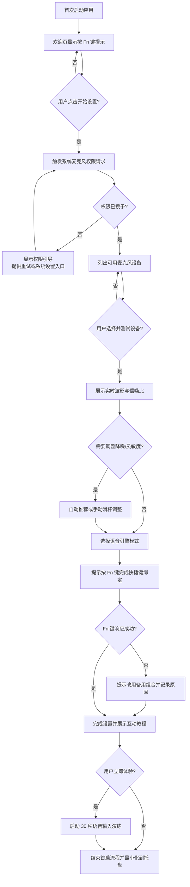
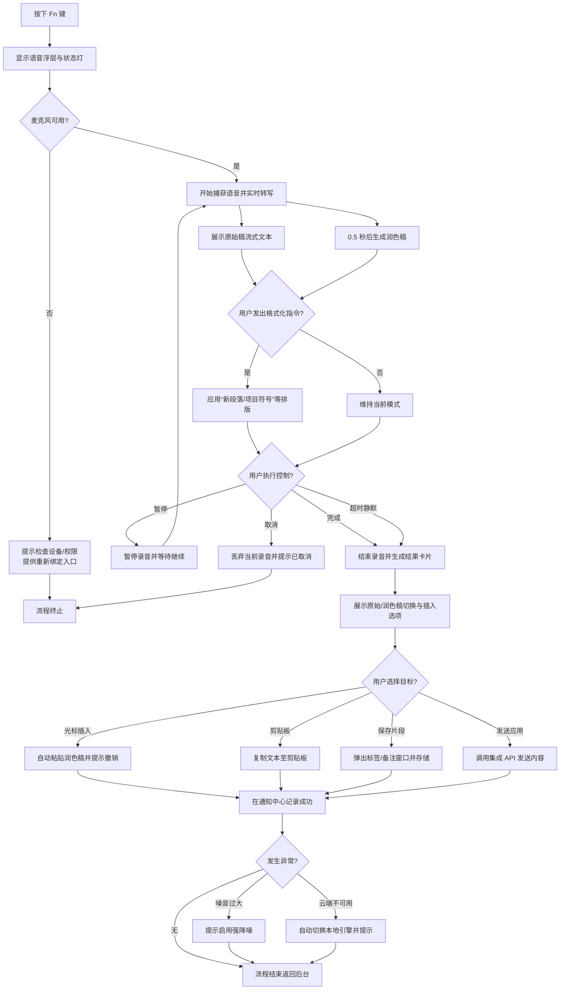
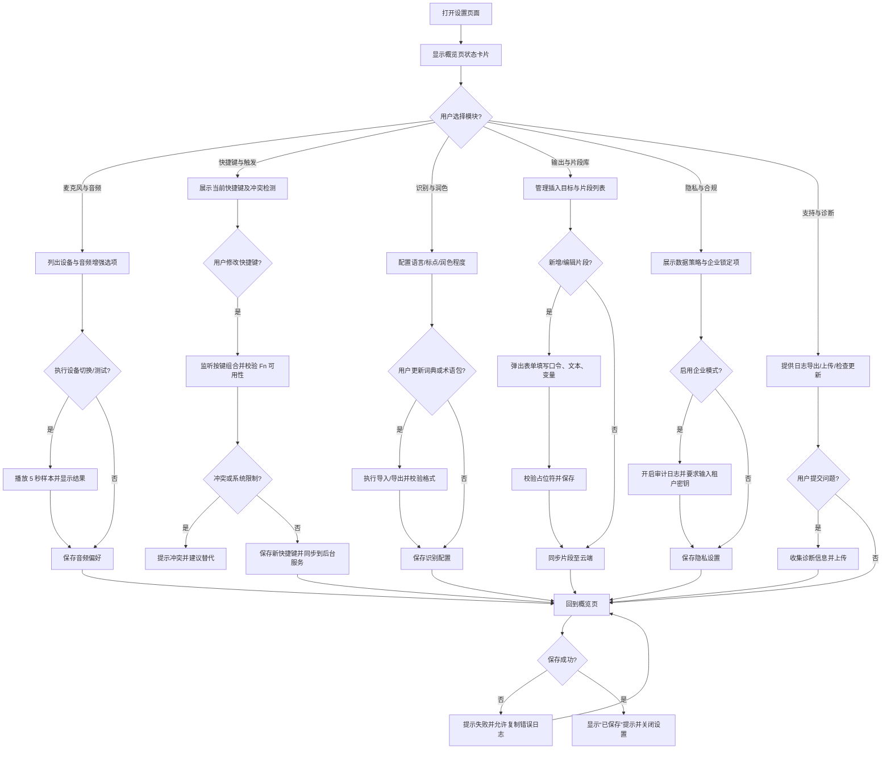

# Flowwisper Fn 语音输入助手 PRD

## 1. 产品概述
Flowwisper Fn 语音输入助手是一款在 macOS 与 Windows 平台均可使用的桌面应用。用户按下键盘上的 Fn（Function）键即可唤起麦克风，实时捕获语音并转换为文字，帮助用户在任意应用中实现快速语音输入，提高效率并减少键盘输入负担。产品定位为面向专业创作与知识工作者的“随处可用语音输入层”，与现有键盘输入并行存在，强调跨平台一致体验与低门槛。

### 1.1 Flow Wispr 产品调研洞察
对标产品 Flow（Wispr Flow）目前在 Mac、Windows、iOS 多端提供语音输入能力，主打“在任意应用中 4 倍于键盘速度的语音输入”，并结合 AI 自动润色实现“说话即成稿”。核心亮点包括：
- **跨应用覆盖**：无需嵌入插件，在 WhatsApp、VS Code、Teams、Notion 等桌面与移动应用中直接口述输入。
- **AI 自动润色**：实时去除语气词、填补标点，输出结构化、清晰的文本，被描述为“将 rambled thoughts 转化为 polished writing”。
- **个人词典与语境自适应**：自动学习用户专有名词，按应用调整语气语调，支持超过 100 种语言自动识别。
- **语音片段库**：可创建语音触发的文本片段，快速插入常用话术或模板。
- **多端同步**：桌面与移动端词典、历史记录同步，强调随时随地一致体验。
- **合规与行业覆盖**：公开强调 SOC2 Type II、HIPAA 准备度，面向医疗、政府、法律、教育等对安全合规要求高的行业场景。

上述能力展示了成熟竞品在“速度、质量、语境理解、合规信任”四个维度的综合发力，对 Flowwisper 的规划具有直接参考价值。

## 2. 产品目标
1. 提供跨平台、低延迟的语音转文字能力，目标达到“4 倍于键盘输入”的内容产出效率体验。
2. 支持按 Fn 键即用、随处可用的语音输入流程，并输出“清晰、结构化”的润色文本。
3. 通过本地与云端混合方案，兼顾隐私、准确率与资源消耗，满足安全敏感行业的部署要求。
4. 打造个人词典、语境自适应与语音片段等 AI 增强能力，建立差异化竞争力。

## 3. 目标用户
- 需要频繁输入文稿、邮件、代码或资料的专业人士（咨询、产品、工程、设计等）。
- 面向客户沟通的团队（销售、客服、客户成功），追求更快的反馈速度。
- 对语音输入有刚需的行业人群（医疗、政府、法律、教育等）与合规敏感用户。
- 需要减少键盘操作的行动不便用户或有 RSI 风险的长时间键入者。
- 需要快速记录灵感、跨语言协作的内容创作者与多语言工作者。

## 4. 使用场景
1. **工作写作**：用户在文档或邮件中按 Fn 键直接口述内容，系统实时输出文字。
2. **会议记录**：会议过程中按 Fn 键启动录音转写，结束后自动生成摘要。
3. **客服与销售**：使用语音片段库快速插入标准话术，自动调整语气适配 IM、邮件等不同渠道。
4. **跨语言协作**：在全球团队中自动识别并转写不同语言，保持上下文准确。
5. **灵感速记**：随时按 Fn 键记录灵感点子，AI 自动润色成结构化笔记或代办事项。

## 5. 用户旅程与典型 Use Case
1. 用户安装并首次启动应用，完成麦克风权限授权与语音引擎选择。
2. 应用在系统托盘常驻，提供状态指示与设置入口。
3. 用户在任意界面按 Fn 键触发语音输入：
   - 屏幕上出现浮动提示、噪音电平与剩余时长。
   - 应用捕获语音并进行实时转写与 AI 自动润色，展示增量结果与编辑建议。
   - 可按 Fn 键再次结束录音、语音命令“完成”或等待自动超时。
4. 转写文本根据设置自动粘贴到光标位置、复制到剪贴板、发送至指定应用或保存至历史记录。
5. 用户可在历史记录中搜索、编辑与导出转写文本，并跨设备同步个人词典与片段库。

### 5.1 Use Case：首次启动与麦克风设置
**触发条件**：用户首次安装并打开应用。

**关键步骤**：
1. **欢迎页与权限提示**：展示简短 onboarding，说明“按 Fn 键即可开始语音输入”，引导用户点击“开始设置”。
2. **系统权限请求**：
   - macOS：调用系统弹窗请求麦克风访问权限，并提供“若被拒绝，前往系统设置 > 安全性与隐私 > 麦克风启用 Flowwisper”的指引链接。
   - Windows：调用麦克风隐私权限提示，若检测到系统层面已禁用麦克风，给出“打开设置 > 隐私 > 麦克风”的跳转按钮。
3. **设备选择与测试**：列出可用麦克风设备（内置、外接 USB/蓝牙），支持播放提示音与实时音量条反馈；用户可点击“开始测试”对着麦克风说话，系统显示实时波形与信噪比。
4. **降噪与灵敏度校准**：提供“自动推荐”“自定义”两种模式，自动读取环境噪音计算推荐阈值；用户可滑动条调整，预览转写片段确保效果。
5. **语音引擎选择**：展示“本地识别（低延迟）”“云端识别（高准确）”“智能混合”选项，默认推荐智能混合，并注明数据处理策略。
6. **快捷键确认**：提示用户按一次 Fn 键完成绑定，若设备不支持，自动转为“按下 ⌥ + 空格”等备选组合并通知原因。
7. **完成与教程**：展示“设置完成”界面，提供 30 秒互动教程（浮层引导模拟一次语音输入），可选择“立即体验”或“稍后查看”。

**异常处理**：
- 权限拒绝时保持置顶提醒，并记录在通知中心；提供“重试授权”和“手动设置指南”。
- 未检测到麦克风时提示插入设备并支持刷新列表；连续失败可引导至客服表单。
- 校准失败（噪音过大）时提示用户更换环境或启用“强降噪模式”。

**流程图**：



### 5.2 Use Case：应用内语音输入流程
**触发条件**：用户已完成首次设置，应用在后台运行，任意界面按下 Fn 键。

**关键步骤**：
1. **长按准备阶段**：用户按下 Fn 键后 150ms 内浮层即刻弹出，先显示“准备中”并播放轻微提示音/触觉反馈，同时出现低透明度的声波预热动画，标记麦克风即将启用。
2. **唤起层展示**：在屏幕中央或光标附近出现半透明控件，显示录制状态灯、实时声波、剩余时间、当前模式（原始/润色），并以颜色与动画区分“准备中/录音中/处理中/完成”四种状态；声波根据拾音强度实时跳动，辅助判断输入是否正常。
3. **语音捕获与实时反馈**：
   - 左侧实时滚动展示原始转写，右侧延迟 0.5 秒显示润色后的整句，同时浮层顶部显示累计录音时长与距离 5 分钟上限的剩余时间进度条。
   - 提供动态提示语，例如“继续说话，我会自动加标点”，当检测到处理暂时排队时显示“处理中，请稍候”；声波条在静音时缩小并提示“未检测到声音”。
4. **插入控制**：用户可通过语音指令（例如“新段落”“改成项目符号”）或快捷键切换排版模式；浮层上提供“暂停”“取消”“完成”按钮。
5. **结束与确认**：
   - 用户再次按 Fn 键、点击“完成”或沉默超过设定阈值后，系统结束录音。
   - 显示“转写完成”卡片，包含原始稿、润色稿切换按钮、插入目标选项（光标位置/剪贴板/片段库）。
6. **结果应用**：默认将润色稿插入当前光标位置，并在通知栏展示“已插入，撤销（⌘Z/CTRL+Z）”提示；若用户选择保存片段，跳出标签与备注输入框。

**异常处理**：
- 当检测到背景噪音突然升高，浮层显示“噪音过大，是否启用强降噪？”提示。
- 如果网络中断导致云端引擎不可用，自动切换至本地模式并弹出横幅说明。
- Fn 键触发失败时弹出对话框，提示检查系统权限或重新绑定快捷键。

**流程图**：



### 5.3 Use Case：设置模块与偏好管理
**触发条件**：用户从托盘图标、菜单栏或快捷键打开设置页面。

**关键步骤**：
1. **概览页**：展示核心状态（当前麦克风、识别模式、最近同步时间），提供常用操作快捷入口。
2. **麦克风与音频**：
   - 支持快速切换输入设备、监听输出设备、开启/关闭回声消除与自动增益。
   - 提供录制 5 秒样本并回放功能，帮助用户评估音质。
3. **快捷键与触发**：自定义唤起按键、双击行为、静音模式（如全屏演示时自动禁用），并支持针对特定应用启用/禁用。
4. **识别与润色**：配置默认语言、标点风格、润色程度（正式/自然/极简），管理个人词典与术语包。
5. **输出与片段库**：设置默认插入目标、是否自动复制到剪贴板、历史保留时长；管理语音片段（口令、文本、变量占位符），支持批量导入导出。
6. **隐私与合规**：查看数据存储位置、上传策略、团队租户密钥；开启企业合规模式后，强制启用审计日志与数据加密策略。
7. **支持与诊断**：提供日志导出、一键上传问题报告、检查更新、查看 FAQ 与社区链接。

**异常处理**：
- 设置变更失败时提示“未能保存，请重试”，并提供“复制错误日志”按钮。
- 当企业策略锁定部分选项时，以锁标识和提示文案说明由管理员统一配置。
- 远程同步冲突时展示差异对比，允许选择保留本地或云端版本。

**流程图**：



## 6. 需求拆解与优先级
| 里程碑 | Must Have（必做） | Should Have（次优） | Could Have（可选） | Won't Have（暂不考虑） |
| --- | --- | --- | --- | --- |
| MVP（T+4 周） | Fn/自定义快捷键全局唤起；本地语音识别（中/英）；实时原始稿显示；光标插入/剪贴板输出；历史记录保留 48 小时；基础设置（设备、权限） | 噪音检测与提示；静默自动结束；本地缓存加密；错误日志导出 | 单次会话>2 分钟延长；快捷键防误触模式 | 团队共享片段、移动端同步 |
| Beta（T+8 周） | 云端引擎切换；AI 润色稿；历史记录全文搜索；语音片段库 v1；企业租户密钥；指标埋点 | 个人词典；自定义润色风格；会议摘要自动生成 | 多语言自动检测（>5 种）；Slack/Teams 直接发送 | 医疗行业模板（延后至 GA） |
| GA（T+12 周） | 多语言自动检测（>20 种）；语气自适应；企业审计日志；性能监控仪表盘 | 团队管理后台；片段库共享；SDK/开放 API | 无线耳机按钮唤起；移动端配套 App | 扩展到 AR/VR 场景 |

## 7. 关键流程验收标准（Gherkin）
### 7.1 首次启动与设备设置
```
Scenario: 用户首次启动完成设备设置
  Given 我是第一次打开应用且尚未授权麦克风
  When 我按照引导授予权限并选择麦克风
  Then 系统应在 90 秒内完成权限校验并播放 5 秒测试音
   And 我可以按 Fn 键触发测试录音并看到实时波形
   And 若 Fn 键不可用系统自动建议备选组合并提示成功绑定
```

### 7.2 语音输入与润色
```
Scenario: 长按 Fn 键完成 2 分钟会议记录
  Given 应用处于后台运行且网络正常
  When 我长按 Fn 键持续讲话 2 分钟
  Then 实时原始稿应在 400ms 内开始出现并保持 1.5 秒以内延迟
   And 润色稿应在 2.5 秒内完成句级更新
   And 会话结束后默认将润色稿插入光标位置并提示撤销操作
   And 历史记录中同步保存原始稿与润色稿且可在 5 秒内检索到该条记录
```

### 7.3 异常与恢复
```
Scenario: 云端引擎不可用时的降级
  Given 用户默认使用云端引擎
  And 云端识别服务超时 3 次
  When 我继续按 Fn 键触发语音输入
  Then 系统应在 1 秒内切换至本地引擎并提示状态横幅
   And 整体延迟不超过本地模式指标（原始稿 < 1.2 秒）
   And 降级事件记录到诊断日志供支持团队追踪
```

## 8. 详细功能规格
### 8.1 语音唤起与控制
- 支持单击 Fn 键启动/结束语音输入，可配置双击或长按行为；响应时间要求 < 120ms。
- 当系统不支持 Fn 键捕获（部分外接键盘），提供自定义快捷键方案，并在设置页标明冲突检测结果。
- 显示清晰的录音状态指示（托盘图标变化、屏幕提示气泡、声音提示），并在热键长按时依序呈现“准备中”“录音中”“处理中”“完成”状态；会话默认时长 2 分钟，可在设置中扩展至 15 分钟，浮层需持续更新剩余时间与网络状态。
- 噪音监测阈值：默认 >60dB 时提示“噪音过大”，允许用户手动调整阈值（40-80dB）。

### 8.2 语音转文字
- 支持实时流式转写，并提供“原始转写”与“AI 润色稿”双视图，允许用户快速切换；每 200ms 推送增量字符，丢包重传不超过 3 次。
- 支持多语言识别（首期中文普通话、英文，Beta 扩展到 5 种语言自动检测、GA 达 20 种）；提供语言切换热键。
- 自动标点、语气词过滤、结构化段落等 AI 编辑能力需支持可配置强度（关闭/轻度/标准/强化）；润色策略默认“标准”并记录在审计日志。
- 支持句子级撤销：用户可选择单句恢复原始稿；所有手动编辑需在 30 秒内与历史记录同步。

### 8.3 输出与分发
- 将转写结果插入当前光标位置、复制到剪贴板、发送至指定应用（Slack、Teams、邮件草稿），并允许配置默认行为；插入失败需提供重试提示。
- 保存最近 500 条转写历史，MVP 保留 48 小时，Beta 扩展至 30 天；支持关键词搜索、标签（最多 30 个）与星标收藏。
- 支持自动生成摘要、要点、会议纪要以及语境化格式（邮件、IM、代码注释模板）；摘要需在 10 秒内生成，支持导出为 Markdown。
- 语音片段库支持最多 200 条片段，每条包含口令、正文与变量（{{name}} 等），提供导入/导出 CSV 功能并校验冲突口令。

### 8.4 设置与个性化
- 配置麦克风设备、采样率（16k/32k/48kHz）、回声消除与语音增强选项；测试录音长度 5 秒并展示信噪比。
- 选择语音识别引擎（本地、云端、混合），支持按应用自定义首选引擎；混合模式需根据网络延迟自动切换策略（>800ms 且错误率>5% 自动降级本地）。
- 设置快捷键行为、自动停用时长、防误触机制（全屏演示自动禁用）、噪音阈值提醒；全屏检测基于系统 API，每 5 秒轮询一次状态。
- 配置隐私策略：上传语音到云端需明确展示数据路径；数据保留时长选项（本地 48 小时、7 天、30 天、自定义）；加密方式 AES-256-GCM；企业合规模式强制启用日志与租户密钥。
- 管理个人词典（最多 5,000 条词条）、术语包与语气风格预设，支持 JSON/CSV 导入导出并提供格式校验报告。

### 8.5 系统集成
- 开机自启动选项默认关闭，首次启动时提示是否开启。
- 系统托盘/菜单栏常驻控制入口展示当前模式、设备状态及最近一次同步时间。
- 日志与故障诊断工具支持一键导出最近 72 小时日志，并提供上传至支持团队的选项；上传需在 60 秒内完成并返回追踪 ID。
- 企业管理接口：支持 REST/Webhook 与 SCIM 同步策略，审计日志提供 JSON 导出，默认每日汇总推送至安全邮箱。

## 9. 非功能性需求与验证
- **性能**：端到端延迟 < 1.5 秒（本地模式），云端模式平均 < 2.2 秒；AI 润色稿生成延迟 < 2.5 秒。性能测试由 QA 团队在 MacBook Pro M1、Intel i7 Windows 设备上以 200 条样本语料验证。
- **准确率**：中文/英文词错误率（WER）≤ 8%（本地），≤ 5%（云端）；Beta 阶段引入自动化回归测试集，每周报告至产品与研发负责人。
- **兼容性**：支持 macOS 12+、Windows 10+；对罗技、Keychron 等 10 款主流外接键盘完成热键兼容测试；记录不兼容列表并在官网公示。
- **稳定性**：长时间待机（8 小时）不崩溃，崩溃恢复时自动重新挂载热键与片段库；Crash 率目标 < 0.5% DAU，由 Sentry 监控告警。
- **安全**：本地数据加密存储（AES-256-GCM），云端通信使用 HTTPS/TLS1.2+；合规选项要求 SOC2 Type II 控制列表映射与 HIPAA BAA 流程文档，由安全团队负责。
- **可访问性**：符合 WCAG 2.1 AA 对比度标准，提供语音提示、放大字体、听障模式实时字幕；QA 使用 NVDA、VoiceOver 进行辅助功能测试。

## 10. 技术方案与依赖约束
- **技术选型标准**：桌面端首选 Tauri + Rust（原因：轻量、原生性能），若需使用 Electron 必须完成内存占用对比并提交技术评审结论；音频处理统一使用 Rust 模块暴露 FFI 接口。
- **第三方服务**：
  - 本地语音识别：Whisper.cpp（ggml-medium 模型，需 AVX2 指令集）；需评估 GPU 加速选项以满足 Windows 老旧 CPU。 
  - 云端语音识别：Azure Speech（标准 S0 方案，每月 1,000 小时配额），需准备超额成本估算与限流策略；作为备选保留 Google Speech-to-Text。
  - AI 润色：OpenAI GPT-4o mini Realtime，平均响应 < 1.8 秒；企业版需支持私有网络访问。
- **跨团队依赖**：
  - 安全与合规团队：提供 SOC2/HIPAA 控制映射、审计模板、租户密钥托管流程（需在 Beta 前完成）。
  - 基础架构团队：提供云端推理服务部署、日志收集与监控（Prometheus + Grafana 仪表盘）。
  - 法务团队：审核隐私政策、服务条款、BAA 样本合同，GA 前完成。
- **PoC 计划**：MVP 前完成本地引擎性能基准（CPU 占用 < 45%，内存 < 500MB）；Beta 前完成云端混合模式压力测试（并发 500 会话）。

## 11. 数据策略与隐私流程
- **数据流图**：
  1. 音频经本地缓冲区处理 → 本地转写或加密上传云端 → 云端识别结果通过 TLS 回传 → 本地缓存与历史存储（AES-256-GCM）。
  2. 日志与指标分离：操作日志保存在本地沙盒，除非用户触发“上传诊断”，否则不出站；指标埋点仅传输匿名化事件。
- **数据生命周期**：默认保留 48 小时，可配置 7/30/90 天；超期自动删除并记录在审计日志；企业模式支持“立删”按钮，触发 5 分钟内完成云端清除。
- **权限矩阵**：
  - 普通用户：可查看个人历史、片段、设置；无权导出日志。
  - 团队管理员：可配置策略、查看团队级统计、下载审计日志。
  - 安全管理员：可访问密钥托管、异常告警配置。
- **审计与回溯**：所有敏感操作（导出历史、修改保留策略、启用云端模式）需记录操作人、时间、结果；审计日志默认每日备份到企业 S3 存储，保留 1 年。
- **撤回机制**：用户删除历史记录时，同步删除云端副本；提供撤回 API 供企业对接 DSR（数据主体请求），承诺 72 小时内响应。

## 12. 关键指标（KPI）与数据来源
- **采集方式**：埋点 SDK（Amplitude）负责 DAU、转写成功率、润色采纳率；性能指标通过客户端性能探针与后端日志结合计算。
- **核心指标与阈值**：
  - DAU：MVP ≥ 500，Beta ≥ 2,000，GA ≥ 5,000。
  - 语音转写成功率：MVP ≥ 85%，Beta ≥ 90%，GA ≥ 95%。
  - 平均转写延迟：MVP ≤ 2.5 秒，Beta ≤ 2.0 秒，GA ≤ 1.5 秒。
  - AI 润色采纳率：Beta ≥ 40%，GA ≥ 55%。
  - 留存率：7 日 ≥ 30%，30 日 ≥ 25%。
  - 客诉率：MVP ≤ 5% DAU，GA ≤ 2% DAU。
- **仪表盘计划**：
  - 产品团队负责在 Beta 前完成 Amplitude 仪表盘搭建。
  - 数据团队在 GA 前将关键指标接入 Looker，提供每周自动报告。

## 13. 里程碑计划与验收门槛
1. **MVP（4 周）**：
   - 验收标准：通过 7.1/7.2 场景测试；性能延迟满足 9 章指标；完成安全审查初版。
   - 交付物：桌面应用可安装包、入门引导、支持文档、兼容性测试报告。
   - 负责人：产品（PO）、桌面端组、语音算法组、安全代表。
2. **Beta（8 周）**：
   - 验收标准：完成云端引擎混合模式、润色稿、片段库；数据策略矩阵上线；指标仪表盘可用。
   - 交付物：企业模式文档、技术评审结论、PoC 报告、客服 FAQ。
   - 负责人：PO、后端平台、数据团队、法务。
3. **GA（12 周）**：
   - 验收标准：多语言检测达 20 种、审计日志与租户密钥上线、性能指标达到 GA 阈值、客户试点通过。
   - 交付物：SOC2/HIPAA 对标材料、上线清单、运营手册、SLA 声明。

## 14. 风险与对策
- **Fn 键捕获受限**：不同设备对 Fn 键处理不同，需提供备用快捷键与硬件适配列表；Beta 前发布兼容矩阵并提供外接键盘驱动方案。
- **语音识别准确率不足**：引入多引擎选择，允许用户上传语料训练自定义模型，并引入 AI 润色补偿；设立周度 WER 监控，超过阈值自动告警。
- **隐私顾虑**：提供透明的权限说明与数据控制面板，默认本地处理并强调合规资质；安全团队每季度复核审计日志流程。
- **跨平台兼容性问题**：测试覆盖常见 macOS、Windows 版本与键盘设备，建立硬件兼容矩阵；若发现高风险兼容问题，提前公告并提供替代方案。
- **AI 润色可信度**：提供原始稿与润色稿双轨可回退，记录修改日志以满足审计需求；针对关键行业提供“保守润色”模式降低过度修改风险。

## 15. 成功标准
- 90% 的测试用户认为按 Fn 键即可可靠地启动/结束语音输入。
- 首次发布后 1 个月内留存率 ≥ 40%，Beta 客户满意度 ≥ 4.3/5。
- 用户满意度（NPS）≥ 30，企业客户合规审计通过率 100%。

## 16. 后续规划
- 移动端扩展：iOS/Android 版本，支持耳机快捷键唤起，并与桌面端共享词典/片段库。
- 团队协作功能：多设备同步历史、共享转写结果、管理员审批流程。
- 开放 API：允许第三方应用直接调用语音转写能力，提供 OAuth2 授权与速率限制策略。

## 附录 A. API & 数据模型规范

### A.1 数据实体概览
| 实体 | 说明 | 关键字段 | 约束/校验 | 示例 |
| --- | --- | --- | --- | --- |
| `TranscriptionSession` | 语音输入会话主记录 | `session_id` (UUID), `user_id`, `source_app`, `start_ts`, `end_ts`, `duration_ms`, `mode` (local/cloud/hybrid), `status`, `error_code` | `duration_ms` ≤ 900000；`status` 取值 {draft, completed, cancelled, failed}；`error_code` 按枚举表维护 | `{ "session_id": "sess_01H...", "user_id": "usr_123", "source_app": "Notion", "mode": "hybrid", "duration_ms": 118000, "status": "completed" }` |
| `TranscriptDraft` | 会话下的文本版本 | `draft_id` (UUID), `session_id`, `type` (raw/polished/summary/bullet/meeting_minutes), `content_md`, `language`, `wer`, `last_synced_at` | `content_md` 上限 20,000 字符；`language` ISO-639-1；`wer` 0-1 浮点 | `{ "draft_id": "drf_01H", "session_id": "sess_01H", "type": "polished", "language": "zh", "wer": 0.06 }` |
| `Snippet` | 语音片段库 | `snippet_id` (UUID), `user_id`, `trigger_phrase`, `body_md`, `variables` (数组), `share_scope` (personal/team), `tags` | `trigger_phrase` 唯一且 2-32 字符；`variables` 仅允许字母数字下划线；`tags` ≤ 30 | `{ "trigger_phrase": "/demo", "variables": ["customer_name"], "share_scope": "personal" }` |
| `HistoryExport` | 历史导出任务 | `export_id`, `user_id`, `format` (csv/md/txt/json), `status`, `created_at`, `expires_at`, `download_url` | 导出文件有效期 7 天；`status` {pending, processing, ready, failed} | `{ "export_id": "exp_001", "format": "md", "status": "ready", "download_url": "https://..." }` |
| `AuditLog` | 合规操作日志 | `log_id`, `actor_id`, `actor_role`, `action` (enum), `resource_type`, `resource_id`, `result` (success/fail), `metadata` (JSON), `timestamp` | `action` 包含 login, change_policy, export_history, enable_cloud, delete_record 等；`metadata` 需脱敏 | `{ "action": "change_policy", "resource_type": "privacy", "metadata": {"retention_days": 30} }` |

### A.2 REST API 契约

#### A.2.1 创建语音会话 (POST `/v1/sessions`)
- **请求体**：`{ "client_ts": 1715052000, "source_app": "Notion", "mode": "hybrid" }`
- **响应**：`201 Created`，返回 `{ "session_id": "sess_01H", "upload_url": "https://..." }`
- **错误码**：`42901` 超出并发上限，`40201` 超出配额，`40301` 未授权使用云端。

#### A.2.2 上传音频分片 (PUT `upload_url`)
- 使用预签名 URL，分片大小 5MB；`Content-Type` 必须为 `audio/webm` 或 `audio/wav`；失败重试 3 次。

#### A.2.3 获取转写结果 (GET `/v1/sessions/{session_id}/transcripts?type=polished`)
- **响应**：`200 OK`，`{ "draft_id": "drf_01H", "content_md": "...", "wer": 0.05, "generated_at": "2024-05-06T10:23:00Z" }`
- 支持 `If-None-Match`/`ETag` 实现增量拉取；缓存失效时间 5 秒。

#### A.2.4 提交片段库项 (POST `/v1/snippets`)
- **请求体**：`{ "trigger_phrase": "/demo", "body_md": "亲爱的 {{customer_name}}...", "variables": ["customer_name"], "share_scope": "personal" }`
- **响应**：`201 Created`；冲突时返回 `40901` 并携带 `conflict_with_snippet_id`。

#### A.2.5 导出历史记录 (POST `/v1/exports`)
- **请求体**：`{ "format": "md", "filters": { "date_from": "2024-05-01", "tag": "meeting" } }`
- **响应**：`202 Accepted`；轮询 `GET /v1/exports/{export_id}` 获取状态。

#### A.2.6 查询审计日志 (GET `/v1/audit-logs`)
- 支持分页与过滤：`actor_role`, `action`, `date_range`；默认按时间倒序；企业管理员需要 `scope=audit:read` 权限。

### A.3 枚举与错误码
| 枚举 | 取值 | 说明 |
| --- | --- | --- |
| `mode` | `local`, `cloud`, `hybrid` | 识别模式 |
| `status` | `draft`, `processing`, `completed`, `cancelled`, `failed` | 会话状态 |
| `error_code` | `1001` 麦克风不可用，`2001` 云端超时，`3001` 权限不足，`4001` 配额不足，`5001` 未知错误 | 错误码范围按模块前缀区分 |

错误码需在客户端本地映射至用户可理解的提示文案，详见《线型交互稿》“系统文案清单”。

### A.4 数据库 Schema 草案
```sql
CREATE TABLE transcription_sessions (
  session_id UUID PRIMARY KEY,
  user_id UUID NOT NULL,
  source_app TEXT,
  start_ts TIMESTAMPTZ NOT NULL,
  end_ts TIMESTAMPTZ,
  duration_ms INT CHECK (duration_ms <= 900000),
  mode TEXT CHECK (mode IN ('local','cloud','hybrid')),
  status TEXT CHECK (status IN ('draft','processing','completed','cancelled','failed')),
  error_code INT,
  created_at TIMESTAMPTZ DEFAULT now()
);

CREATE TABLE transcript_drafts (
  draft_id UUID PRIMARY KEY,
  session_id UUID REFERENCES transcription_sessions(session_id) ON DELETE CASCADE,
  type TEXT CHECK (type IN ('raw','polished','summary','bullet','meeting_minutes')),
  content_md TEXT CHECK (char_length(content_md) <= 20000),
  language CHAR(2),
  wer NUMERIC(4,3),
  last_synced_at TIMESTAMPTZ
);

CREATE TABLE snippets (
  snippet_id UUID PRIMARY KEY,
  user_id UUID NOT NULL,
  trigger_phrase TEXT UNIQUE,
  body_md TEXT,
  variables JSONB,
  share_scope TEXT CHECK (share_scope IN ('personal','team')),
  tags TEXT[],
  created_at TIMESTAMPTZ DEFAULT now()
);
```

## 附录 B. 测试与发布计划

### B.1 测试策略总览
| 测试类型 | 覆盖范围 | 工具 & 环境 | 责任角色 | 频率 |
| --- | --- | --- | --- | --- |
| 功能测试 | 首次引导、语音输入、历史、设置、片段库 | 桌面端自动化（Playwright + RobotJS）、手工回归 | QA Owner | 每周/版本前 |
| 性能测试 | 端到端延迟、CPU/内存占用、云端切换 | 内部基准脚本 + Grafana Dashboard | QA + 后端 | 每周 + 发布前 |
| 稳定性测试 | 长时运行、睡眠唤醒、网络抖动 | Chaos Monkey for Desktop、脚本化热键触发 | 客户端研发 | 每两周 |
| 可访问性测试 | VoiceOver/NVDA、键盘导航、对比度 | Axe-core、手工辅助 | QA + UX | 每个里程碑前 |
| 安全与合规 | 加密验证、日志审计、权限矩阵 | SAST (Semgrep)、DAST (OWASP Zap)、审计清单 | 安全团队 | Beta/GA 前 |

### B.2 里程碑测试用例覆盖
- **MVP**：确保 7.1/7.2 场景转化为不少于 40 条用例，覆盖成功、权限拒绝、噪音过大、云端降级等分支；建立自动冒烟脚本，运行时长 < 15 分钟。
- **Beta**：扩充到 80 条用例，包含云端混合、片段库共享、摘要生成、多语言检测；引入性能基准回归（语音样本 200 条）。
- **GA**：>120 条用例，覆盖企业审计、租户密钥、回滚流程、埋点准确性；所有阻断缺陷必须在发布前 5 天关闭。

### B.3 发布节奏与责任矩阵 (RACI)
| 活动 | 产品 | 客户端研发 | 后端/平台 | QA | DevOps | 安全/法务 |
| --- | --- | --- | --- | --- | --- | --- |
| 版本规划与冻结 | R | C | C | C | I | I |
| 需求基线审查 | R | A | A | C | I | C |
| 提交合并 & Code Review | I | A | A | C | C | I |
| 自动化测试执行 | C | R | R | A | C | I |
| 发布包构建与签名 | C | R | C | C | A | I |
| 灰度发布与监控 | C | R | R | C | A | I |
| 合规材料提交 | C | I | I | I | I | A |

### B.4 CI/CD & 灰度流程
1. **主干策略**：采用 trunk-based 开发，feature 分支需通过单元/集成测试与 lint 方可合并；主干每日触发夜间构建。
2. **构建流水线**：GitHub Actions → 安装依赖 → 单元测试 → 构建 Tauri/Windows 包 → 运行端到端脚本 → 生成签名候选包。
3. **签名与分发**：
   - macOS 使用 Apple Developer ID，CI 中生成 `.pkg` 并经 Notarization；
   - Windows 使用 EV 代码签名证书，由 DevOps 维护 HSM。
4. **灰度发布**：采用 10%-30%-100% 渐进策略，先内部狗粮，再邀请 Beta 白名单用户；监控 Crash、WER、延迟，超过阈值即暂停扩散。
5. **回滚策略**：保留最近 3 个稳定版本，客户端内置“回退到上一个版本”开关；服务器端配置版本开关，允许停用云端新功能。

### B.5 监控与告警
- **实时指标**：延迟、成功率、云端降级次数、Crash 率、CPU/内存、语音样本上传失败数；Grafana 仪表盘支持 1 分钟刷新。
- **告警阈值**：
  - 延迟 > 2.5 秒持续 5 分钟触发黄色告警，>3.5 秒触发红色告警。
  - Crash 率 30 分钟内 > 1% 触发 PagerDuty。
  - 云端降级次数 10 分钟内 > 50 次提示检查 Azure 状态。
- **埋点准确性**：Amplitude 中每日执行事件缺失检测，若某事件 24 小时无数据自动告警。

## 附录 C. 埋点事件字典
| 事件名称 | 触发时机 | 关键属性 | 指标映射 |
| --- | --- | --- | --- |
| `voice_session_started` | Fn 唤起并进入录音 | `mode`, `source_app`, `network_latency_ms`, `has_headset` | 会话启动率、触发延迟 |
| `voice_session_completed` | 成功完成录音并插入/保存 | `duration_ms`, `output_target`, `downgraded` (bool), `wer`, `ai_adopted` | 转写成功率、降级率 |
| `voice_session_failed` | 会话失败 | `failure_stage` (permission/audio_upload/transcription/postprocess), `error_code` | 失败率拆解 |
| `snippet_saved` | 片段保存 | `source` (history/manual/import), `variables_count`, `share_scope` | 片段使用率 |
| `history_export_started` | 用户触发导出 | `format`, `range`, `filter_tags` | 导出需求 |
| `settings_changed` | 任意设置保存 | `section`, `field`, `is_admin_locked`, `old_value_hash`, `new_value_hash` | 配置变更监控 |
| `compliance_mode_toggled` | 合规模式切换 | `tenant_id`, `enabled`, `reason` | 合规执行 |
| `diagnostic_uploaded` | 用户上传日志 | `issue_type`, `upload_duration_ms`, `success` | 支持质量 |

## 附录 D. 合规执行计划
- **SOC2**：列出 18 个控制项，产品需交付访问控制、变更管理、系统监控证据；安全团队每月抽样审计日志。
- **HIPAA**：确保所有受保护健康信息（PHI）默认留在本地或加密存储；与法务在 Beta 前签署 BAA 模板，提供数据处理协议模板。
- **数据主体请求 (DSR)**：建立支持流程，承诺 72 小时内响应，提供在线工单模板与责任人（安全管理员）。
- **隐私政策更新**：MVP 发布前完成中文版/英文版隐私政策，Beta 前完成多语言本地化；所有用户在应用内须重新确认。

## 附录 E. 发布与运维手册摘要
1. **渠道策略**：
   - 官方网站提供最新版下载；
   - macOS 通过 DMG/PKG + 自动更新；
   - Windows 通过 EXE/MSIX，企业渠道提供离线包；
   - 内部狗粮通过私有 CDN 与自动更新通道。
2. **版本命名**：`主版本.次版本.补丁+build`（例 `1.2.0+20240510`），主版本对齐里程碑，补丁用于热修复。
3. **问题响应级别**：
   - P0：语音无法启动或大规模崩溃，1 小时内回滚或热修复。
   - P1：核心流程显著降级，4 小时内给出缓解方案。
   - P2：功能性缺陷不阻断，下一补丁修复。
4. **运维例行任务**：
   - 每日检查监控仪表盘与告警；
   - 每周复盘失败会话 Top 10 错误码；
   - 每月导出审计日志归档至安全团队存储；
   - 每季度演练回滚与灾难恢复（DR）。

## 附录 F. 成本与容量假设

| 项目 | 假设 | 月度成本估算 | 降级/扩容策略 | 负责人 |
| --- | --- | --- | --- | --- |
| Azure Speech S0 | 1,000 小时免费 + 超额 $1/小时；MVP 预计 600 小时，Beta 1,500 小时 | MVP：$0；Beta：约 $500；GA：约 $1,500 | 超出 80% 配额时自动降级至本地模式并通知管理员；支持临时扩容到 S1 | 后端平台 |
| OpenAI GPT-4o mini Realtime | $0.0005/秒；MVP 平均 60 秒/DAU | MVP：$900（基于 500 DAU）；Beta：$3,600（2,000 DAU）；GA：$9,000（5,000 DAU） | 高峰时可切换至批处理润色或降低润色频率 | 产品 + 财务 |
| CDN & 更新分发 | Cloudflare CDN Pro，含 5TB 流量 | $200/月 | 超出流量时切换至 AWS S3 + CloudFront 备份域名 | DevOps |
| 监控与日志 | Grafana Cloud + Sentry Business | $350/月 | 若超额则迁移到自建 Prometheus + Loki | DevOps |
| 语音模型推理硬件 | 自建 GPU 节点 2 台（A10G），按需预留 | $2,400/月 | 当 CPU 模式超 75% 利用率时切换 GPU；提供按需租赁方案 | 基础架构 |

### F.1 降级流程图（云端不可用）

```mermaid
flowchart LR
    A[检测到 Azure Speech 超时 >=3 次] --> B{是否达到配额 80%?}
    B -- 否 --> C[记录降级事件]
    B -- 是 --> D[通知管理员 + PagerDuty]
    C --> E[切换至本地引擎]
    D --> E
    E --> F{本地引擎可用?}
    F -- 否 --> G[提示用户稍后重试并禁用云端模式]
    F -- 是 --> H[继续转写并标记会话 downgraded=true]
    H --> I[埋点 voice_session_completed(downgraded)]
    G --> I
```

### F.2 SLA 目标
- **识别服务可用性**：99.5% 月度；超过 30 分钟不可用需发布 RCA。
- **润色服务可用性**：99.0%；若低于阈值需触发补偿策略（额外配额）。
- **客户支持响应**：P0 1 小时、P1 4 小时、P2 1 个工作日。


